# 🚀 SYED JOHAR ABBAS
<div align="center">


</div>

```ascii
    ╔══════════════════════════════════════════════════════════════════════╗
    ║                    🌐 SOFTWARE ENGINEER EXTRAORDINAIRE 🌐             ║
    ║                                                                      ║
    ║  > Compiling dreams into reality since... well, let's just say      ║
    ║    I've been at this longer than JavaScript has had decent          ║
    ║    package management (and that's saying something!)                ║
    ║                                                                      ║
    ║  💻 Stack Overflow Reputation: "It's complicated"                   ║
    ║  🐛 Bugs Fixed: ∞ (and counting)                                    ║
    ║  ☕ Coffee Consumed: ERROR - Integer Overflow                        ║
    ╚══════════════════════════════════════════════════════════════════════╝
```

<div align="center">

[+%7B+panic!();+%7D;while(bugs.exist())+%7B+debug();+%7D;return+%22Hello%2C+World!%22;+%2F%2F+The+classic;async+Task%3CBool%3E+CanCode()+%7B+return+true;+%7D;SELECT+*+FROM+developers+WHERE+awesome+%3D+true;docker+run+--rm+-it+johar%2Fawesome-dev)](https://git.io/typing-svg)

</div>

---

## 🤖 **SYSTEM INFORMATION**

```bash
johar@universe:~$ neofetch

                     .-/+oossssoo+/-.               johar@universe
                 `:+ssssssssssssssssss+:`           ---------------
               -+ssssssssssssssssssyyssss+-         OS: Human OS 2024.1 LTS
             .ossssssssssssssssssdMMMNysssso.       Host: Software Engineer
            /ssssssssssshdmmNNmmyNMMMMhssssss/      Kernel: Brain v3.2.1-stable
           +ssssssssshmydMMMMMMMNddddyssssssss+     Uptime: 20+ years (no reboots)
          /sssssssshNMMMyhhyyyyhmNMMMNhssssssss/    Packages: 1000+ (npm, nuget, composer)
         .ssssssssdMMMNhsssssssssshNMMMdssssssss.   Shell: PowerShell Core 7.x
         +sssshhhyNMMNyssssssssssssyNMMMysssssss+   Resolution: 4K+ Problems Daily
         ossyNMMMNyMMhsssssssssssssshmmmhssssssso   DE: Visual Studio + VS Code
         ossyNMMMNyMMhsssssssssssssshmmmhssssssso   WM: Multiple Monitors Always
         +sssshhhyNMMNyssssssssssssyNMMMysssssss+   Theme: Dark Mode (obviously)
         .ssssssssdMMMNhsssssssssshNMMMdssssssss.   Icons: Font Awesome + Devicons
          /sssssssshNMMMyhhyyyyhdNMMMNhssssssss/    Terminal: Windows Terminal + iTerm2
           +sssssssssdmydMMMMMMMMddddyssssssss+     CPU: Brain (16 cores, overclocked)
            /ssssssssssshdmNNNNmyNMMMMhssssss/      GPU: Imagination RTX 4090Ti
             .ossssssssssssssssssdMMMNysssso.       Memory: Unlimited (cloud-native)
               -+sssssssssssssssssyyyssss+-         Disk: SSD + Infinite Git Repos
                 `:+ssssssssssssssssss+:`           
                     .-/+oossssoo+/-.               
```

---

## 🛠️ **TECH STACK.EXE - LOADING...**

<div align="center">

[](https://git.io/typing-svg)

</div>

### 🔥 **PRIMARY WEAPONS OF MASS CONSTRUCTION**

```csharp
public class JoharTechArsenal 
{
    // The languages that pay my rent (and buy my coffee)
    public readonly Language[] PrimaryWeapons = {
        new Language("C#", skillLevel: 9001, 
                   description: "My mother tongue in the digital realm"),
        new Language("JavaScript", skillLevel: 8500, 
                   description: "Love-hate relationship status: It's complicated"),
        new Language("TypeScript", skillLevel: 8000, 
                   description: "JavaScript's responsible older sibling"),
        new Language("SQL", skillLevel: 7500, 
                   description: "Speaking fluent database since day one")
    };
    
    // Frameworks that make me go 'Ooh, shiny!'
    public readonly Framework[] PowerTools = {
        new Framework(".NET", version: "8.0", 
                    opinion: "Like a Swiss Army knife, but cooler"),
        new Framework("Blazor", version: "Latest", 
                    opinion: "C# in the browser? *chef's kiss*"),
        new Framework("Angular", version: "17+", 
                    opinion: "When you need structure (lots of it)"),
        new Framework("Entity Framework", version: "Core", 
                    opinion: "Making databases less scary since 2008")
    };
}
```

<div align="center">

### 💻 **LANGUAGES & FRAMEWORKS**


### 🗄️ **DATABASE WIZARDRY**


### ☁️ **CLOUD & DEVOPS SORCERY**


</div>

---

## 🎯 **SKILL TREE BREAKDOWN**

```mermaid
graph TD
    A[🧠 Johar's Brain v2024] --> B[💻 Coding Skills]
    A --> C[🏗️ Architecture]
    A --> D[☁️ Cloud Native]
    A --> E[🔧 DevOps]
    
    B --> B1[C# Mastery: Level 99]
    B --> B2[JavaScript Tolerance: Level 85]
    B --> B3[TypeScript Appreciation: Level 80]
    B --> B4[SQL Fluency: Level 90]
    
    C --> C1[Microservices Architecture]
    C --> C2[Clean Architecture Patterns]
    C --> C3[SOLID Principles Enforcement]
    C --> C4[Domain-Driven Design]
    
    D --> D1[Azure Service Whisperer]
    D --> D2[Container Orchestration Ninja]
    D --> D3[Serverless Function Magician]
    
    E --> E1[CI/CD Pipeline Architect]
    E --> E2[Infrastructure as Code Prophet]
    E --> E3[Automation Enthusiast]
    
    style A fill:#ff6b6b,stroke:#333,stroke-width:4px
    style B fill:#4ecdc4,stroke:#333,stroke-width:2px
    style C fill:#45b7d1,stroke:#333,stroke-width:2px
    style D fill:#96ceb4,stroke:#333,stroke-width:2px
    style E fill:#ffeaa7,stroke:#333,stroke-width:2px
```




---

## 🏆 **ACHIEVEMENT UNLOCKED**

```javascript
const achievements = {
    "🎖️ Code Warrior": {
        description: "Survived the Great Semicolon Wars of 2010-2020",
        rarity: "Legendary",
        dateUnlocked: "Every day since I started coding"
    },
    
    "🐛 Bug Whisperer": {
        description: "Can communicate with bugs in their native habitat",
        specialAbility: "Debugging by rubber duck conversation",
        effectiveness: "87.3% (the other 12.7% are feature requests)"
    },
    
    "☕ Caffeine Powered": {
        description: "Successfully converted coffee into enterprise software",
        conversionRate: "1 cup = 50 lines of production-ready code",
        sideEffects: "Occasional jitters and eternal optimism"
    },
    
    "🚀 Deployment Master": {
        description: "Zero-downtime deployments (most of the time)",
        motto: "Deploy fast, break nothing, fix everything",
        panicLevel: "Surprisingly low"
    },
    
    "🧙‍♂️ Architecture Wizard": {
        description: "Can design systems that actually scale",
        magicalPowers: ["Microservices", "Event Sourcing", "CQRS"],
        weakness: "Sometimes over-engineers a TODO app"
    }
};

console.log("Current Level: Senior+++ (XP: 999,999/1,000,000)");
```

---

## 📊 **REAL-TIME DASHBOARD**

<div align="center">

[](https://github.com/syedjoharabbas)


[](https://github.com/syedjoharabbas)


[](https://github.com/syedjoharabbas)

</div>

---

## 🎪 **THE JOHAR EXPERIENCE™**

### 🎭 **Daily Routine (In Code)**

```csharp
public async Task<bool> DailyLife()
{
    var morning = await Coffee.Brew(strength: Maximum, cups: 3);

    while (DateTime.Now.Hour < 18 && !IsWeekend())
    {
        var problems = await FindProblemsToSolve();
        var solutions = await CreateElegantSolutions(problems);
        await DeploySafely(solutions);
        
        if (RandomNumberGenerator.GetInt32(100) < 20)
        {
            await RefactorSomethingForFun();
        }
    }

    await StackOverflow.BrowseQuestions(sortBy: "Interesting");
    await GitHub.ExploreAwesomeRepos();

    return true; // Another successful day of not breaking production
}
```

### 🎮 **Gaming & Tech Exploration Stats**

```ascii
┌─────────────────────────────────────────────────┐
│  🎮 GAMING METRICS                              │
├─────────────────────────────────────────────────┤
│  Current Status: [████████░░] 80% Addicted     │
│  Favorite Genre: Strategy & Tech Simulators    │
│  All-Time High: 14 hour coding session         │
│  Coffee Break Games: 2048, Tetris              │
│  Weekend Projects: Game development in Unity   │
└─────────────────────────────────────────────────┘

┌─────────────────────────────────────────────────┐
│  🔬 TECH EXPLORATION LAB                        │
├─────────────────────────────────────────────────┤
│  └── Currently Experimenting With:              │
│      ├── WebAssembly + Blazor = 🤯             │
│      ├── AI/ML integration in .NET             │
│      ├── Edge computing with IoT               │
│      └── Quantum computing (just for fun!)     │
│                                                 │
│  └── Weekend Side Projects:                     │
│      ├── ./personal-ai-assistant               │
│      ├── ./home-automation-hub                 │
│      └── ./yet-another-todo-app (it's different!)│
└─────────────────────────────────────────────────┘
```

---

## 🚀 **CURRENT MISSION STATUS**


<div align="center">


[](https://git.io/typing-svg)

</div>


```yaml
current_projects:
  🔥 hot_and_spicy:
    - name: "Secret Awesome Project™"
      status: "Compiling..."
      description: "If I told you, it wouldn't be secret!"
      tech_stack: ["C#", "Blazor", "Azure", "Magic"]
      
  🌱 growing_seeds:
    - name: "Next-Gen Enterprise Solution"
      progress: "Architecture design phase"
      excitement_level: "Through the roof!"
      
  🧪 experiments:
    - name: "AI-Powered Code Reviews"
      hypothesis: "Can AI write better commit messages than humans?"
      current_results: "Surprisingly, yes!"

learning_queue:
  priority_high:
    - "Advanced Kubernetes patterns"
    - "Microservices observability"
    - "WebAssembly deep dive"
    
  priority_medium:
    - "Quantum computing basics"
    - "Advanced TypeScript wizardry"
    - "Docker optimization techniques"
    
  priority_when_bored:
    - "Yet another JavaScript framework"
    - "Rust (because why not?)"
    - "How to exit Vim (still working on this)"
```

---

## 🌌 **THE PHILOSOPHY OF CODE**

```python
class CodingPhilosophy:
    def __init__(self):
        self.mantras = [
            "Code is poetry that runs",
            "If it works, don't touch it (but document why it works)",
            "There are only two hard things in Computer Science: " +
            "cache invalidation, naming things, and off-by-one errors",
            "It's not a bug, it's an undocumented feature",
            "In production, everything is a feature until proven otherwise"
        ]
        
        self.coding_principles = {
            "KISS": "Keep It Simple, Stupid (but not too simple)",
            "DRY": "Don't Repeat Yourself (copy-paste is not DRY)",
            "YAGNI": "You Aren't Gonna Need It (but you probably will)",
            "SOLID": "The holy grail of object-oriented design",
            "Clean Code": "Code should read like a well-written prose"
        }
        
    def wisdom_of_the_day(self):
        return random.choice([
            "A working software is better than perfect documentation",
            "Premature optimization is the root of all evil... or is it?",
            "Git commit -m 'Fixed stuff' // We've all been there",
            "99 bugs in the code, 99 bugs in the code, take one down, patch it around, 127 bugs in the code"
        ])
```

---

## 🎨 **FAVORITE TOOLS & WEAPONS**

<div align="center">

### 🛠️ **THE DEVELOPMENT ARMORY**


</div>

```bash
# My IDE Setup (AKA "The Command Center")
├── 🎯 Visual Studio 2022
│   ├── Extensions: 47 (and counting)
│   ├── Theme: Dark (always dark)
│   └── Productivity: +9000%
│
├── ⚡ Visual Studio Code
│   ├── Extensions: Only the essential 73
│   ├── Themes: Rotate weekly (because variety)
│   └── Terminal: Integrated (obviously)
│
├── 🚀 JetBrains Rider
│   ├── For when VS isn't being cooperative
│   ├── Refactoring: Godlike
│   └── Debugging: Next level
│
└── 🐱 Git + GitHub
    ├── Commits per day: 15.7 average
    ├── Branch naming: feature/make-it-awesome
    └── Merge strategy: Squash and pray
```

### 🔧 **PRODUCTIVITY ENHANCERS**

```javascript
const productivityStack = {
    terminal: {
        primary: "Windows Terminal",
        shell: "PowerShell Core 7.x",
        theme: "Oh My Posh with custom theme",
        aliases: "More aliases than actual commands"
    },
    
    documentation: {
        markdown: "Everything is markdown",
        diagrams: "Mermaid.js (because flowcharts are cool)",
        notes: "Obsidian with 847 linked notes",
        todo: "GitHub Issues (dogfooding at its finest)"
    },
    
    communication: {
        slack: "For the memes and updates",
        teams: "Because corporate mandates",
        discord: "For the tech communities",
        stackoverflow: "For existential crises"
    }
};

console.log("Productivity Level: Maximum Overdrive");
```

---

## 🌟 **CONNECT WITH THE MATRIX**

<div align="center">

[](https://www.linkedin.com/in/joharabbas/)
[](https://github.com/syedjoharabbas)
[](https://stackoverflow.com/users/your-profile)

</div>

### 💬 **AVAILABLE COMMUNICATION PROTOCOLS**

```typescript
interface CommunicationOptions {
    professionalInquiries: "LinkedIn DM" | "Email";
    techDiscussions: "GitHub Issues" | "Twitter";
    casualChat: "Discord" | "Slack";
    emergencies: "Carrier Pigeon" | "Smoke Signals";
    
    // Response time SLA
    responseTime: {
        bugReports: "Immediate (if it's breaking prod)";
        featureRequests: "1-2 business days";
        coffeeInvites: "5 minutes";
        rubberDuckDebugging: "Always available";
    };
}

const contactMe: CommunicationOptions = {
    // Implementation details classified 🤫
    preferredTopics: [
        "Clean Architecture", 
        "Microservices Drama", 
        "Why JavaScript is weird",
        "Docker container naming conventions",
        "The eternal vim vs emacs debate"
    ]
};
```

---

## 🎪 **EASTER EGGS & HIDDEN FEATURES**

<details>
<summary>🎁 <b>Click here for a surprise!</b></summary>

```ascii
    🎉 CONGRATULATIONS! 🎉
    
    You found the hidden section!
    
    ░░░░░▄▄▄▄▀▀▀▀▀▀▀▀▄▄▄▄▄▄░░░░░░░
    ░░░░░█░░░░▒▒▒▒▒▒▒▒▒▒▒▒░░▀▀▄░░░░
    ░░░░█░░░▒▒▒▒▒▒░░░░░░░░▒▒▒░░█░░░
    ░░░█░░░░░░▄██▀▄▄░░░░░▄▄▄░░░░█░░
    ░▄▀▒▄▄▄▒░█▀▀▀▀▄▄█░░░██▄▄█░░░░█░
    █░▒█▒▄░▀▄▄▄▀░░░░░░░░█░░░▒▒▒▒▒░█
    █░▒█░█▀▄▄░░░░░█▀░░░░▀▄░░▄▀▀▀▄▒█
    ░█░▀▄░█▄░█▀▄▄░▀░▀▀░▄▄▀░░░░█░░█░
    ░░█░░░▀▄▀█▄▄░█▀▀▀▄▄▄▄▀▀█▀██░█░░
    ░░░█░░░░██░░▀█▄▄▄█▄▄█▄████░█░░░
    ░░░░█░░░░▀▀▄░█░░░█░█▀██████░█░░
    ░░░░░▀▄░░░░░▀▀▄▄▄█▄█▄█▄█▄▀░░█░░
    ░░░░░░░▀▄▄░▒▒▒▒░░░░░░░░░░▒░░░█░
    ░░░░░░░░░░▀▀▄▄░▒▒▒▒▒▒▒▒▒▒░░░░█░
    ░░░░░░░░░░░░░░▀▄▄▄▄▄░░░░░░░░█░░
    
    Fun Facts About This README:
    - Contains approximately 847 emoji
    - Written while consuming 12 cups of coffee
    - Took longer to write than my last feature
    - Has more animations than a Disney movie
    - 73.2% of statistics are made up on the spot
    - You're awesome for reading this far! 🌟
```

</details>

---

<div align="center">

[](https://git.io/typing-svg)


### 🌟 **SYSTEM STATUS: ONLINE AND READY TO CODE!** 🌟

```bash
$ echo "Thanks for visiting! Happy coding! 🚀"
Thanks for visiting! Happy coding! 🚀

$ git add friendship
$ git commit -m "Added awesome connection"
$ git push origin collaboration
```

</div>
